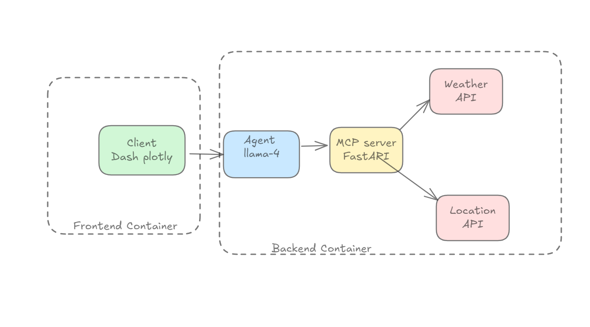
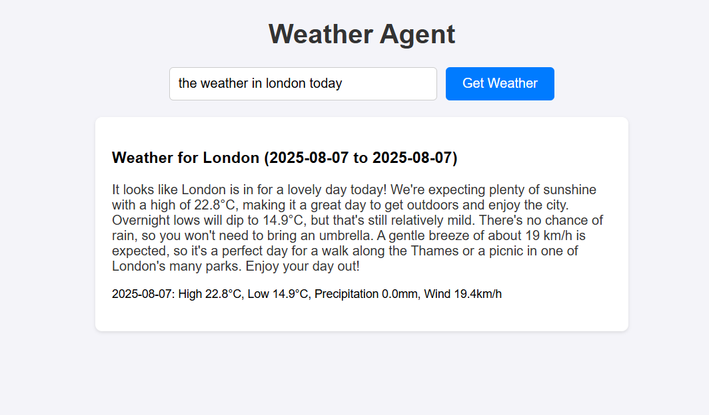

# AgenticAIWeather

An intelligent weather assistant that processes natural language queries, autonomously fetches weather data, and delivers AI-processed responses.

## Technology Stack

| Component          | Technology                          | Purpose                           |
|--------------------|-------------------------------------|-----------------------------------|
| **MCP Server**     | FastAPI (Python)                    | Backend API and service orchestration |
| **UI Framework**   | Dash + Plotly                       | Front client                |
| **AI Agent Core**  | Pure Python (No framework)          | Agent logic and decision engine   |
| **LLM Integration**| Groq + LLaMA-4                      | Natural language processing       |
| **Containerization**| Docker + Docker Compose            | Deployment and isolation          |
    


## Project Structure
```bash
agenticaiweather/
│
├── backend/
│   ├── app/
│   │   ├── agent/               # LLM agent logic, tools, models
│   │   └── api/                 # FastAPI routes and handlers
│   ├── Dockerfile               # Backend container
│   ├── main.py                  # FastAPI app entrypoint
│   └── requirements.txt         # Backend dependencies
│
├── frontend/
│   ├── app/
│   │   └── app.py               # Dash app
│   ├── Dockerfile               # Frontend container
│   └── requirements.txt         # Frontend dependencies
│
├── .env                         # Environment config file
├── docker-compose.yml           # Compose file to run full system
└── README.md                    # This file
```
## System Architecture



## User Interface



## Installation and running project

1. Clone the repository:
```bash
git clone git@github.com:akrembnmb/agenticAIweather.git

```
2. Launch instructions:
```bash
cd agenticAIweather
docker-compose up --build
```
This will run the project
## Important Note About API Keys

**The included Groq API key is temporary and will be revoked**. 